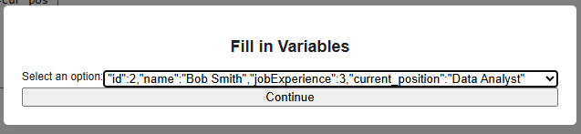
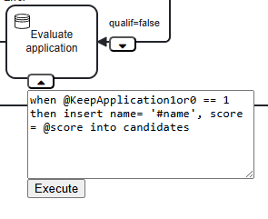
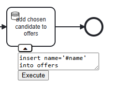

# Turtorial
In this turtorial only the custom data objects introduced by this extension will be explained. To see the formal definitions of the data language see [Data language](README.md#data-manipulation-language)
There are two ways of creating a data-task object. The first option is in the left toolbar. The blue database icon will create a data-task. The second is while an object is selected the element pallet will also show the data-task icon. By clicking on the dataTask icon i will create the datatask and make an edge between the original object and the datatask.

  

   

By clicking the dropdown menu button, in the bottom of the data-task, a textfield will be shown. This is where the user can specify what the data task should do.

## Running example
Throughout this page we will be showcasing examples from the model of a job applicationprocess, available upon running the program. There is also an sql file located at [data-BPMN/jobApplicationExample/jobApplication.sql](jobApplicationExample/jobApplication.sql) that can be run in a DBMS to use the model.

   

## How To Precondition
Bellow is shown two examples, first of a logical precodition and then of a select precondition:
1:

   

What this task does if either the process variable #job_ex is grater than 5 or if #current_pos is equal to 'HR' then the effect (setting the process variable #qualif to 1) will be executed.

2:

   

A select precondition that returns the attributes: _id, name, jobExperience, current_position_ from the table _CV_.
After a successfull select precondition the user will be promted, by a popup, to choose between the returned results.

   

Then the mentions of these attributes in the effect will be substituted for the chossen values before the effect is executed. 
In this example id will be substituted with the value '2', name with 'Bob Smith' and so on.

## How To User input
If the user defines a user input varriable, in the format _@inputVariable_, in either the precondition or effect the user will be promted to input the value upon execution of the task.

   

   

## How To Insert
Here is an example of an insert effect:

   

There are the same restrictions on our insert statment as a standard SQL insert query. As such any requiered atributes (primary keys and any that are specified as not null) will have to be specifed, as to not cause integrty constraints. Any other attributes not specified will be set to null.

## How To Delete
Here is an example of a delete effect:

   

This will be parsed to a _DELETE FROM CV WHERE id = #id_, with the current value of #id in place of the variable name. Therfore it is important to be pricise in the construction of a delete statment as to only delete the intended value(s). It is possible to construct a delete statment with a filter in place of the atributes (e.g _delete id != 1 from CV_).

## How To Update
Here is an example of an update effect:

   

This example is more complex than the others.
First a select precondition returns the atributes _id, name and score_ from the table _candidates_. The user will then choose which of the returend tupels to use in the effect. After which the id atribute specifed in the effect will be replaced by the selected value for it. __It is important to note that only the atribute to the right of the equal sing will be replaced and not the one on the left__
  
Update is case sensitive in the attribute names, so if the user writes: _when ID = id_, then the update will fail.

## Failed Query 
In this example i, by "mistake", tried to delete from a table that is not in the database.

   

A popup will then appear, giving you the ability to edit the failed sql query and when clicking confirm it will retry the query. That will happen until a valid query is reached or the user cancels, if the simulation is running it will only move on from the task if the query is successfull or the user cancels the simulation attempt this is the case for both the precondition and effect.