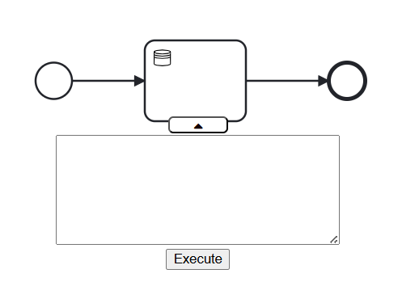

# Data-aware extension of bpmn.io

[](https://github.com/bpmn-io/bpmn-js-token-simulation/actions?query=workflow%3ACI)

A tool for modelling data-aware BPMN with simulation capablities, inspired by [delta-BPMN](https://link.springer.com/chapter/10.1007/978-3-030-85469-0_13) and built as a [bpmn-js](https://github.com/bpmn-io/bpmn-js) extension.


## Overview


On Startup the front page has a modeller and vivew button which takes you to the bpmn tool. A change to the front page is the database connection hub below the buttons. This is where you connect you database to the tool. It is possible to use the tool without connection a database but you would not be able to use any of our database tasks. 

<p align="left">
  
</p>

In order to connect to your database you need to fill in the neccessary fields of  Host, Port, User, Password, and database name.
When filled, click the "Connect" button and the red dot will turn green if the connection is established

<p align="left">
  
</p>


When clicking on modeller all the standard bpmn.io functions are avaliable and layout is mostly the same as the standard bpmn.io, except these new buttons. 


 

The top button toggles between the modeler mode and the simulation mode. The bottom 3 buttons are for defining process variables, downloading the diagram, and opening a database oerview of the connected database. The download button downloads a BPMN file, which can then be dragged and dropped into any modeler with this extension. 

The process variables button opens a text field where the user can define process variables in the format ‘#[variable name] : [value]’. The variable names must be unique, and the value can be a number or a string; no quotes are necessary. All variables must be separated with a semicolon.

<p align="left">
  
</p>


The Mariadb button shows a simple overview of all the tables in the database. These tables are clickable and it will show all rows in the selected database. The database should be connected if you followed the steps on the front page and the green light appeared. As this tool is not intended to be a database manipulation tool the database button does not make it possible to change things in the database. This is only possible through the datatasks (look in tutorial). For similar reasons it is not at all possible to introduce new tables through this tool. 

<p align="left">
   
</p>


 Now that a database can be very large it is possible to showcase the database in a new window where the properties in that window are exactly the same as the little popup shown in the original window. 

 <p align="left">
   
</p>

When you click on a table when viewing what is inside the table. Primary key(s) as well as foreign key(s) are also shown. Clicking on the "Back to table list" will bring you back to the db overview 

<p align="left">
   
</p>


## Turtorial
1. Use the small blue button in the bottom of the element menu to create a data task or open the element pallet by clicking on an element.

<p align="left">
  
</p>

2.	Click the dropdown menu button, in the bottom of the data task. This reveals the precondition and effect field.

<p align="left">
   
</p>

3.	Now, begin writing either the preconditions or the effects. If no precondition is defined, the effects will immediately take hold when the task is executed.
 
In the preconditon you can write a select statement if anything returns from the select the prcondition is regarded as true and the effect will be executed. A precondition is also a #var>10 or #var=string similarly to the select precon the effect will execute if the statement is true. It needs to be said that if the precon is not true the effect will not execute. 

Primary keys cannot be changed and should not be changed therefore we do not support the change of primaryKeys

Input variables are written with a @ like @inputVariable. When the simulation reaches the datatask it will ask you to fill in your input variables.

when assigning variables from the returned select statements if more rows are returned. The value that goes into the process variable is nondeterministically chosen by the user. if more variables are assigned in one statement it can only be from the same row of the table(example shown in assign)

If a query fails the simulation will pause and a popup textfield will appear where you can change the sql query and it will then retry. The simulation will only proceed when the query is valid(the database doesnt throw an error)

The execute button executes the query inside and should not normally be used when using the simulator. This is just a fail safe way to execute a query


An example of Insert,Delete,Update,Assign will be shown below. In my example i will be using a Database over Shopping mall with the revelevant tables of 

# Insert
The formal definition of insert is INSERT v1,...,vn INTO R where v is a column in table R

<p align="left">
   
</p>


# Delete
The formal definition of delete is DELETE v1,...,vn FROM R where v is a column in table r 

<p align="left">
   
</p>

# update
The formal definition of Update is
<p align="left">
   
</p>
Where R.a is an attribute in a table R and v is a local variable 

<p align="left">
   
</p>
This example has a precondition involved at the top. The update statement can have an ELSE which changes every row that is not included in the When clauses. If not else is put in then all rows that are not relevant to any of the when clauses will remain as they are. Even if a row is affected in the when clause it is only the attributes that is stated that will change. Every other attribute in that row will remain the same 

update is case sensitive in the attribute names such as Location and Name 

# assign + precondition + inputVariables

<p align="left">
   
</p>
this query selects all the names and mallid's from store and then assigns the to the process variables #var and #str

when the datatask is run, and if more values are returned, a box will appear where you choose which values you would like to choose

<p align="left">
   
</p>
When selection a value and clicking on the button the values will be assigned and the simulation will continue. Keep in mind that if you assign more variables in one datatask it can only choose information from the same row. 

Lets use the same query to show a input variables case 
<p align="left">
   
</p>
when the simulation reaches the datatask a box will then appear asking you to fill in the input variables 

<p align="left">
   
</p>
When clicking continue the variables assign will be happen as shown in the example before 


# Failed Query 
In this example i by mistake tried to delete from a table that is not in the database.

<p align="left">
   
</p>

A box will then appear, giving you the ability to fix the failed sql query and when clicking confirm it will retry the query. That will happen until a valid query is reached and the simulation will continue. 


## Simulation Capabilities

The simulation capabilities is build on top of an existing extension [bpmn-js-token-simulation](https://github.com/bpmn-io/bpmn-js-token-simulation). The simulation and the extension works together in two ways one is when a token reaches a data-aware component it triggers it and the second is when modelling, custom control flow can be defined. Custom control flow is added using the element menu by clicking on an edge. 

<p align="left">
  
</p>

Define a simple condition and append it using the POST button.

<p align="left">
  
</p>

## logger 
The simulation has a logger that logs all things happening in the simulation. The logger on our part focuses on the datatasks and will log if a query succeeded or failed. If failed it will return the given error from the database. As well as logging when the database queries fails or succeeds it also notifies when the simulation pauses and continues from a failed query.

<p align="left">
  
</p>

## Clone, Build and Run

Start by cloning this project, then prepare the project by installing all dependencies using npm:

```sh
npm install
```

Then use the following command:

```sh

# spin up the example with server
npm run start:example2
```


## Links

* [delta-BPMN](https://link.springer.com/chapter/10.1007/978-3-030-85469-0_13) - The framework used as the foundation for this extension.
* [Token simulation](https://github.com/bpmn-io/bpmn-js-token-simulation) - More info about the simulator and its internals


## Licence

MIT
