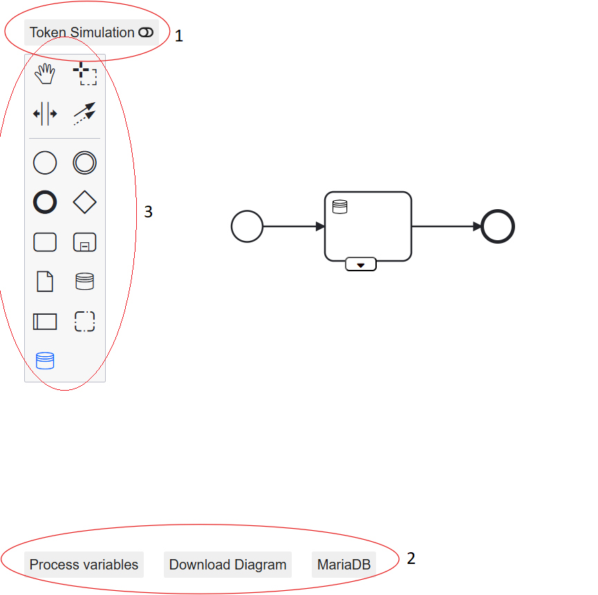
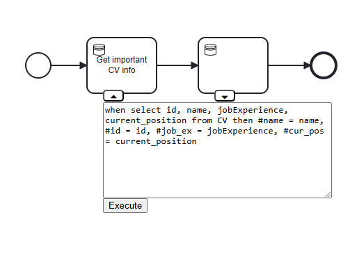
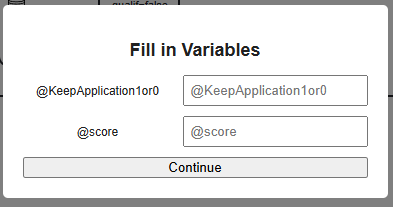
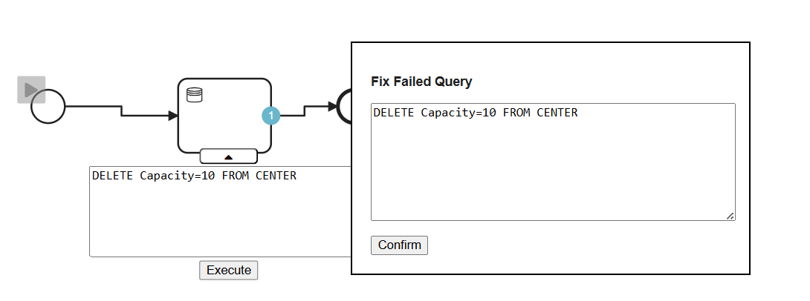

# Data-aware extension of bpmn.io

[](https://github.com/bpmn-io/bpmn-js-token-simulation/actions?query=workflow%3ACI)

A tool for modelling data-aware BPMN with simulation capablities, inspired by [delta-BPMN](https://link.springer.com/chapter/10.1007/978-3-030-85469-0_13) and built as a [bpmn-js](https://github.com/bpmn-io/bpmn-js) extension. This tool includes process variables (volitile data) and custom data objects that can interact with and minipulate persistant data in a database. 


# Overview

## Running example
Throughout this page we will be showcasing examples from the model available upon running the program. There is also an sql file located at _data-BPMN/jobApplicationExample/jobApplication.sql_ that can be run in a DBMS to use the model.

## How to use the tool
Upon startup, the front page will be shown consisting of two buttons linking to the modelling and viewing tools. Below this is the database connection hub. Here the user can establish a connection to a database. It is possible to use the tool without connecting to a database but then the functionallity will be limited. 

<p align="left">
  
</p>

In order to connect to your database you will need to fill in the neccessary fields of  Host (IP-address/localhost), Port(the port running the database server), User, Password, and database name.
When filled, click the "Connect" button and the red dot will turn green if the connection is established.

<p align="left">
  
</p>


Clicking on the modeler button will bring the user to the modelling tool where all the standard bpmn.io activities and events are avaliable as well as the new custom elements and the token-simulation. 


 

The top left button toggles between the modeler mode and the simulation mode. The bottom 3 buttons are for defining process variables, downloading the diagram, and opening a database overview of the connected database. The download button downloads an xml formated BPMN file, which can then be opened in the platform by drag and dropping the file into the tool. 

The process variables button opens a text field where the user can define process variables in the format ‘#[variable name] : [value]’. The variable names must be unique, and the value can be a number or a string; no quotes are necessary. All variables must be separated with a semicolon. Pressing the process button will instanciate the process variables. The process variables will be saved together with the model and upon opening a model the process variables will automatically be instantiated.

<p align="left">
  
</p>

The Mariadb button shows a simple overview of all the tables in the database. These tables are clickable and it will show all relations in the selected table. It is only possible to view the database through this feature and not manipulate it. This is of course only available if a database was successfully conected.  

<p align="left">
   
</p>

 <p align="left">
   
</p>

It is also possible to showcase the database in a new window where it is possible to see primary key(s) as well as foreign key(s) relations.

<p align="left">
   
</p>


# Turtorial
In this turtorial only the custom data objects introduced by this extension will be explained.
There are two ways of creating a data-task object. The first option is in the left toolbar. The blue database icon will create a data-task. The second open is while an object is selected the element pallet will also show the data-task icon. By clicking on the dataTask icon i will create the datatask and make an edge between the original object and the datatask.
<p align="left">
  
</p>

By clicking the dropdown menu button, in the bottom of the data-task, a textfield will be shown. This is where the user can specify what the data task should do.

<p align="left">
   
</p>

## Precondition
The syntax of a data-task is specifeied as follows:
_When precondition then effect_ or just _effect_
The precondition can either be a logical expression consisting of constants and/or process variables, where the operations __<,>,<=,>=,==,!=__ are allowed, or a select statment in the format:
_select attribute(s) from table(s) where filter_ (normal sql format and functionality).
If anything is returend from the select statment the precondition is evaluated to true.
After a successfull select precondition the user will be promted to choose between the returned results, this allows the user to use any returned atributes in the effect.
If there is no precondition the effect will always be executed.


Here is a small example of how data from a select precondition is handeled.
This query selects all the names and mallid's from store and then assigns the to the process variables #var and #str

<p align="left">
   
</p>

<p align="left">
   
</p>


Primary keys cannot be changed and should not be changed therefore we do not support the change of primaryKeys

Our data task also supports user input variables that are written with a @ like _@inputVariable_. When the simulation reaches the datatask it will ask you to fill in your input variables.

<p align="left">
   
</p>
When the simulation reaches the datatask a popup will appear promting the user to fill in the input variables 

<p align="left">
   
</p>

An example of Insert,Delete,Update,Assign will be shown below. In our examples we will be using a Database over Shopping mall with the revelevant tables of 

## Insert
The formal definition of insert is _INSERT a1=v1,...,an=vn INTO R_ where a1..an are the atribute names in table R and v1..vn are values.

<p align="left">
   
</p>


## Delete
The formal definition of delete is _DELETE v1,...,vn FROM R_ where v1..vn are the values of atributes in table R (not every attribute needs to be specified just primary key(s))

<p align="left">
   
</p>

## update
The formal definition of Update is
<p align="left">
   
</p>
Where a1..am is an attribute in a table R and u1..um is a value and F1..Fk are conditions.
This will go through the specified table row for row and see if the current row satisfies any of the conditions. The attributes will be set to the values specified in the _THEN_ clause of the first satisfied condition. The update statement can have an _ELSE_ which changes every row that is not included in one of the _WHEN_ clauses_. If _ELSE_ is not specifed then all rows in the database that do not satisfy one of the conditions remain unaltered. If a new value is not specified for a given atribute then it will remain unaltered.

An example can be seen below.
<p align="left">
   
</p>
  
Update is case sensitive in the attribute names such as Location and Name.

 # Control flow
Another custom component is the conditional flow. This adds conditions to the sequence flow out of an exclusive gateway. The conditions support constants and process variables and the operations __<,>,<=,>=,==,!=__. 
Custom control flow is added using the element menu by clicking on an edge. 

<p align="left">
  
</p>

<p align="left">
  
</p>


# Simulation Capabilities

The simulation capabilities are built on top of an existing extension [bpmn-js-token-simulation](https://github.com/bpmn-io/bpmn-js-token-simulation). Our extension of the simulation is to make it can handle the custom objects specified above correctly. When a token reaches a data task component, it then pauses the simulation execution until the task is completed. 
When a token reaches an exclusive gateway all the sequnce flows conditions are evaluated (if there is no condition the simulator treat them as _True_). It then chooses non-determanisticly between the _True_ sequence flows. If there is no valid path then the simulation will reset.


## Failed Query 
In this example i by mistake tried to delete from a table that is not in the database.

<p align="left">
   
</p>

A popup will then appear, giving you the ability to edit the failed sql query and when clicking confirm it will retry the query. That will happen until a valid query is reached and the simulation will continue or the user cancels the simulation attempt.
## logger 
The simulation has a logger that logs all the steps taken in the simulation. The logger on our part focuses on the datatasks and will log if a query succeeded or failed. If it failed it will return the given error from the database. It also logs when the database queries fails or succeeds it also notifies when the simulation pauses and continues from a failed query.

<p align="left">
  
</p>

# Clone, Build and Run

Start by cloning this project, then prepare the project by installing all dependencies using npm:

```sh
npm install
```

Then use the following command:

```sh

# spin up the example with server
npm run start:example2
```


## Links

* [delta-BPMN](https://link.springer.com/chapter/10.1007/978-3-030-85469-0_13) - The framework used as the foundation for this extension.
* [Token simulation](https://github.com/bpmn-io/bpmn-js-token-simulation) - More info about the simulator and its internals


## Licence

MIT
