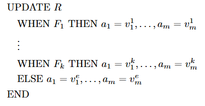

# Data-aware extension of bpmn.io

[](https://github.com/bpmn-io/bpmn-js-token-simulation/actions?query=workflow%3ACI)

This is a web based tool for modelling business processes with data manipulation elements, inspired by [delta-BPMN](https://link.springer.com/chapter/10.1007/978-3-030-85469-0_13) and built as a [bpmn-js](https://github.com/bpmn-io/bpmn-js) extension. The process control flow is modelled using BPMN, where gateways and activities can be provided with explicit definitions of data manipulation expressions. Such expressions operate over the volatile (i.e., process variables) and persistent (i.e., a database) data. We describe below how to manipulate these data components.

# Tool dependencies
This platform is a JavaScript extension of bpmn.io and therefore the main codebase is the bpmn-js library. We utilise NPM (Node Package Manager) as a package manger, which is recommended by bpmn.io's [Forum](https://bpmn.io/toolkit/bpmn-js/walkthrough/). Other than this library there are a number of important dependencies:

1. bpmn-js-token-simulation (v 0.31.1)
This is an extension for bpmn-js that enables token-based simulation capabilities for BPMN models.

2. buffer (v 6.0.3)
A utility library essential for managing binary data, which is required for some visual elements.

3. downloadejs (v 1.4.7)
This library is used to download files in web applications. We use it to download the diagrams in XML format.

4. inherits-browser (v 0.1.0)
This library handles inheritance for JavaScript classes and is a dependency for token simulation.

5. webpack (v 5.74.0)
A module bundler used to compile JavaScript modules and assets for the project.

6. webpack-cli (v 4.10.0)
A command-line interface for webpack, used to configure and run webpack tasks.

7. webpack-dev-server (v 4.11.1)
A development server for webpack that provides live reloading and other development features.

8. express (v 4.21.2)
A minimal and flexible Node.js web application framework used to build the server-side components of the tool.

9. MariaDB (v 3.4.0)
MariaDB is an open-source relational database management system (RDBMS) that is a fork of MySQL. It is designed to provide high performance, scalability, and reliability for managing structured data. MariaDB is used in this project to store and manage persistent data, such as process variables and database tables, which are accessed and manipulated during the simulation and modeling processes.

# Setup

## Clone, Build and Run
Start by cloning this project, then prepare the project by installing all dependencies using npm in the root of the project:

```sh
npm install
```

Then use the following command:

```sh

# spin up the example with server
npm run start:example2
```
## Database
To use all the features of this tool, an instance of a relational database running on a server is required, and it is therefore assumed that the user has access to one. The required information for a successful database connection is:

1. The host (i.e., the IP address of the host)
2. The port that the server is listening on
3. A valid username and password
4. The name of the desired database

## Starting up the tool
Upon startup, the front page will be shown, consisting of two buttons linking to the modeling and viewing tools. Below these is the database connection hub. Here, the user can establish a connection to a database using the information specified above. It is possible to use the tool without connecting to a database, but the functionality will be limited.

<p align="left">  </p> 
When the fields are filled in correctly, click the "Connect" button, and the red dot will turn green if the connection is successful. 
<p align="left">  </p> ```

## Modeler layout
Clicking on the modeler button will bring the user to the modelling tool where all the standard bpmn.io activities and events, see [BPMN components](#bpmn-components), are avaliable as well as the new custom elements and the token-simulation. 


 

The top left button (1) toggles between the modeler mode and the simulation mode. The bottom 3 buttons (2) are for defining process variables, downloading the diagram, and opening a database overview of the connected database.The toolbar in the left side (3) is where the basic BPMN components, as well as a new custom task, and the tools necessary to interact with the platform are located. 
  
The download button downloads an xml formatted BPMN file, which can then be opened in the platform by dragging  and dropping the file into the tool. 
  
The process variables button opens a text field where the user can define process variables. See [data components](#data-components)
  
The Mariadb button shows a simple overview of all the tables in the database. These tables are clickable and it will show all relations in the selected table. It is only possible to view the database through this feature and not manipulate it. This is of course only available if a database was successfully connected.  

<p align="left">
   
</p>

 <p align="left">
   
</p>

It is also possible to showcase the database in a new window where it is possible to see primary key(s) as well as foreign key(s) relations.

<p align="left">
   
</p>

# BPMN components
As mentioned before this tool extends BPMN.io as such we support the BPMN 2.0 standard, which includes:
1. Activities: Tasks e.g. Service Task, User task ect. as well as subprocesses 
2. Events: Start, Intermediate and End events with various triggers
3. Gateways: Exclusive, Parallel, Event-based ect.
4. Sequence flows
The above is not an extensive list but the most important for the full documentation see [Camunda](https://docs.camunda.io/docs/components/modeler/bpmn/bpmn-coverage/?utm_source=chatgpt.com). 
In addition to the BPMN 2.0 functionality we introduce a new custom data-task, explained in [Data-task](#data-task), and custom conditional sequence flow, explained in [Conditional Flow](#conditional-flow).

# Data
Before explaining how to create and use the new elements, we will define the data components and the data manipulation language.

## Data components
We support two types of data, volatile (i.e process variables) and persistent data (i.e a database). The volatile data is execution specific and their current state will not be saved if the program is exited, while any changes to the persistent data will be saved to the connected database. The volatile data can be specified by defining them in the process variable field, by pressing the button shown above in (2), in the format '#[variable name] : [value]'. The variable names must be unique, and the value can be a number or a string, no quotes are necessary. All variables must be separated with a semicolon. Pressing the process button will instantiate the process variables. The process variables will be saved together with the model and upon opening a model the process variables will automatically be instantiated to the default value written in the process variable field.
<p align="left">
  
</p>
We also support user input, by writing '@[input-name]' in a data task the user will be prompted to input some data.

## Data Manipulation Language
In this section we will explain the language used to manipulate data. You can see examples of the language [Here](Examples.md).

### Syntax
The language follows a simple syntax of:
_When precondition then effect_ or just _effect_
If a precondition is present then it will be evaluated and if and only if it is evaluated to true then the effect will be executed, if there is no precondition then the effect will always be executed.

#### Precondition
The precondition can either be a logical expression consisting of constants and/or process variables/user input, where the operations __<,>,<=,>=,==,!=__ are allowed, or a select statement  in the format:
_select attribute(s) from table(s) where filter_ (Here a filter is any valid sql filter such as 'attribute = x').
If anything is returned from the select statement the precondition is evaluated to true.

#### Effect
The effect can be:
1. Updates of process variables i.e #var = x, #var2 = y
2. Insert
3. Delete
4. Update

We also allow for values returned by a select precondition to be used in the effect. This means that if the precondition is _select x from y_ then any mention of x in the effect will be changed to the specific value returned by the query.

##### Insert
The formal definition of insert is _INSERT a1=v1,...,an=vn INTO R_ where a1..an are the attribute names in table R and v1..vn are values.

##### Delete
The formal definition of delete is _DELETE v1,...,vn FROM R_ where v1..vn are the values of attributes in table R (not every attribute needs to be specified just primary key(s))

##### Update
The formal definition of Update is:
<p align="left">
   
</p>
Where a1..am is an attribute in a table R and v1..vm is a value and F1..Fk are conditions.
This will go through the specified table row for row and see if the current row satisfies any of the conditions. The attributes will be set to the values specified in the _THEN_ clause of the first satisfied condition. The update statement can have an _ELSE_ which changes every row that is not included in one of the _WHEN_ clauses_. If _ELSE_ is not specified then all rows in the database that do not satisfy one of the conditions remain unaltered. If a new value is not specified for a given attribute then it will remain unaltered.


## Data-task
The main feature of this extension is the data-task (the blue database icon as seen below and in [(3)](#modeler-layout)) which is a custom activity that allows for data manipulation. 
<p align="left">
  
</p>
<p align="left">
   
</p>
Visually the data-task is an activity with a dropdown button that reveals a textbox where the data expression can be written according to the specifications of the [Data Manipulation Language](#data-manipulation-language). The 'Execute' button under the data-task text field will execute the query, this can be used to check if the task does what the user intends.


## Conditional Flow
The other custom feature that we have in our extension is the conditional sequence flow. This adds conditions to the sequence flow out of an exclusive gateway. The conditions support constants, process variables and the operations __<,>,<=,>=,==,!=__. 
Custom control flow is added using the element menu by selecting an edge, pressing the tool icon and then selecting 'conditional Sequence Flow' as shown below. 

<p align="left">
  
</p>

A dropdown menu will then appear, where the user can specify the condition.
<p align="left">
  
</p>


# Simulation Capabilities

The simulation capabilities are built on top of an existing extension [bpmn-js-token-simulation](https://github.com/bpmn-io/bpmn-js-token-simulation). We have extended it so it can handle the custom objects specified above. When a token reaches a data task component, it then pauses the simulation execution until the task is completed. It logs information of the task such as the evaluation of the precondition, if present, the updated value of any process variables or if changes to volatile data were successful or not. If a query to the database fails the user will have the opportunity to change the data-task and try again, the error from the database will be available in the logger, this is not a perfect solution because the input causing the violation may have happened in another task and is therefore not able to be changed if this is the case the user has to exit the simulation.

When simulating the model, and a token reaches an exclusive gateway, the simulation engine will evaluate all the conditions over the current state of variables, any non conditional sequence flow will always be evaluated to true. After this a path will non deterministically be chosen. If no valid paths are found the simulation will log this and then exit.

## Links

* [delta-BPMN](https://link.springer.com/chapter/10.1007/978-3-030-85469-0_13) - The framework used as the foundation for this extension.
* [Token simulation](https://github.com/bpmn-io/bpmn-js-token-simulation) - More info about the simulator and its internals


## Licence

MIT
